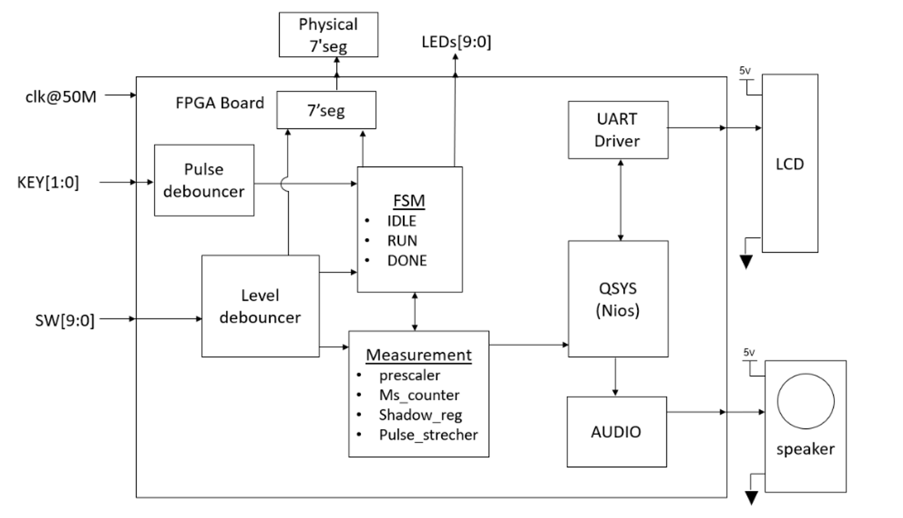
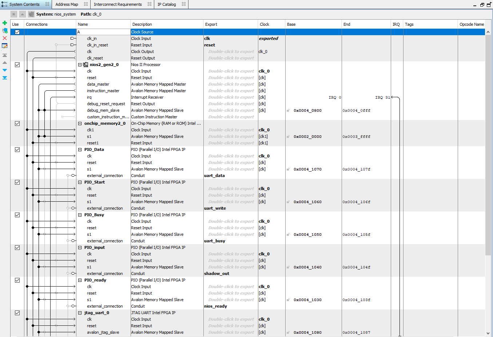
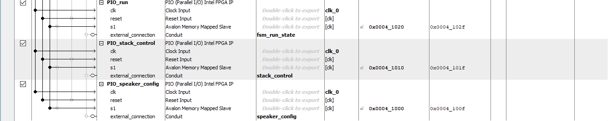
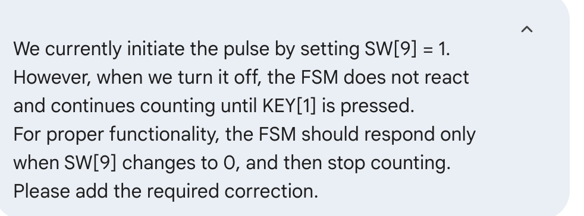
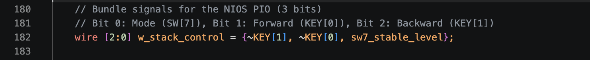
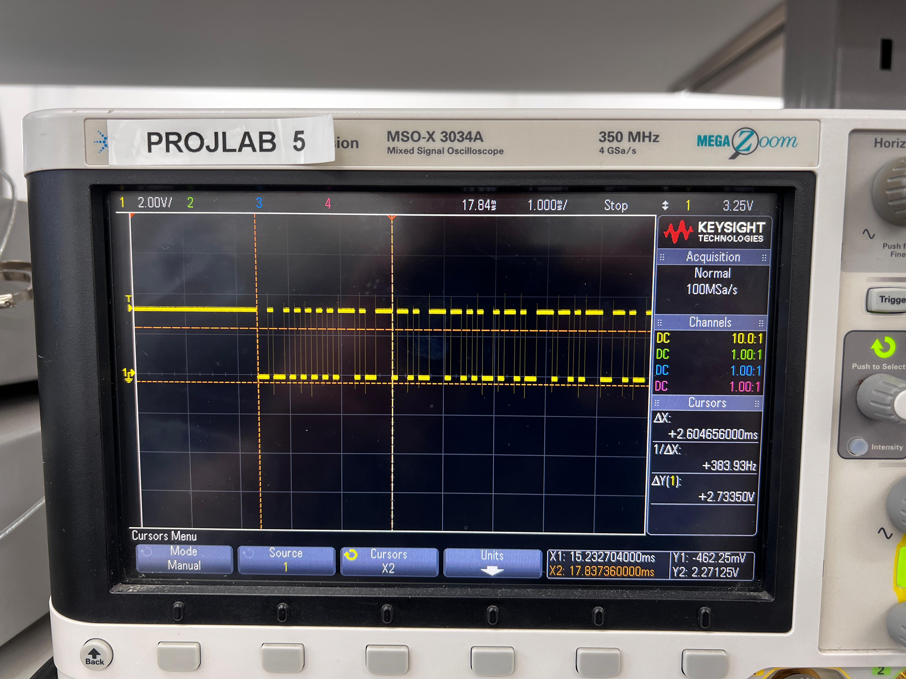
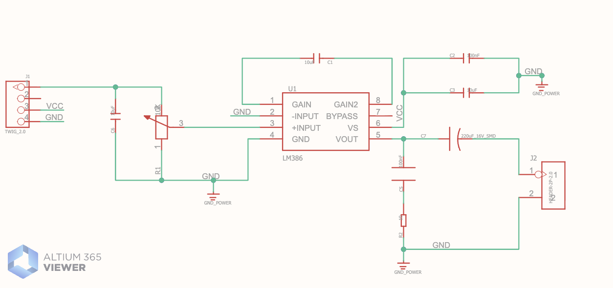
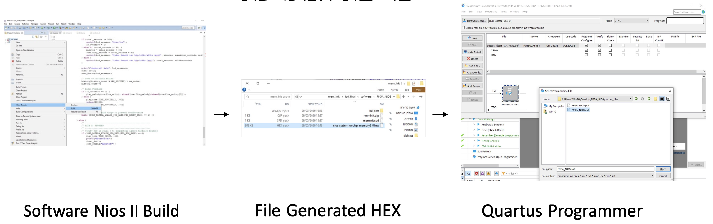

# AI-Assisted FPGA Pulse Measurement System

**B.Sc. Final Project - School of Electrical Engineering**  
**Tel Aviv University, The Iby and Aladar Fleischman Faculty of Engineering**

**A high-precision, real-time digital pulse measurement system implemented on an Intel MAX 10 FPGA (DE10-Lite board). This project blends concurrent Verilog hardware logic with C-based software running on a Nios II soft-core processor, developed extensively using AI-driven debugging methodologies.**

**Developers:** Moshe Sofer & Yehonatan Ilan  
**Institution:** Tel Aviv University, Faculty of Engineering

---

## 📖 Project Overview

Measuring digital signals with high precision in real-time is a critical requirement in embedded control systems. Traditional Microcontroller Units (MCUs) often struggle with strict real-time constraints due to software execution delays, interrupt latency, and sequential processing jitter. 

This project provides a robust solution by leveraging the parallel processing power of FPGA logic for critical time-counting operations, combined with the flexibility of an embedded Nios II processor for data management and UI. The system operates on a 50MHz clock, achieving exact 1ms measurement resolution. A unique aspect of this development process was the heavy integration of Generative AI throughout the RTL design and physical debugging phases to bridge the gap between theoretical logic and physical hardware behavior.

## ✨ Key Features

* **High-Precision Timing:** Hardware-level clock cycle counting driven by the FPGA's 50MHz oscillator. A custom prescaler divides the clock to generate exact 1ms ticks, ensuring precision without software overhead.
* **Dual Operation Modes:**
  * *Normal Stopwatch Mode:* Measures pulses triggered by physical push-buttons (`KEY[0]`/`KEY[1]`) or a level-detected switch (`SW[9]`).
  * *Stack Memory Mode:* A software-managed circular buffer stores the last 10 measurements, allowing the user to browse history via an external LCD.
* **Rich User Interface:** Real-time cascaded BCD 7-segment display for live counting, coupled with an external 16x2 UART LCD (operating at 9600 Baud) for detailed status, timeout errors, and memory readouts.
* **Audio Feedback (PWM):** A custom hardware speaker module controlled by the Nios II processor generates specific frequencies (square waves) corresponding to system events (e.g., success tones, overflow warnings, and classical melodies).
* **Fast Test Mode:** A dedicated hardware switch (`SW[3]`) accelerates the counting and display speed by 5x to allow rapid functional verification of long-duration measurements (up to the 5-minute timeout limit).

---

## 🏗️ System Architecture

The architecture follows a Top-Down modular design, distinctly separating time-critical hardware tasks from software-level data processing.

### 1. Hardware Layer (Verilog RTL)
* **Debouncers & Edge Detectors:** Mechanical switches generate contact bounce—a rapid sequence of voltage spikes. Custom saturating-counter debouncers were implemented: 1.31ms delay for buttons (producing a single-cycle pulse) and a 1ms stable-level verification for switches.
* **Finite State Machine (FSM):** The central control unit featuring three main states: `IDLE`, `RUN`, and `DONE`. It manages the flow of the measurement, enforces input mode-locking, and controls the measurement counters.
* **Measurement Unit:** Contains the 32-bit counter and relies on two critical synchronization mechanisms to bridge the fast hardware and the slower software domains:
  * **Shadow Register:** Captures the final counter value immediately when the pulse ends, preventing race conditions before the Nios II processor reads the data.
  * **Pulse Stretcher:** Expands the 1-cycle `ready` signal from the FSM into a 1ms pulse, ensuring the Nios II processor successfully detects the event during its polling cycle.
* **UART TX Driver:** A purely hardware-based serial driver operating at 9600 Baud, converting parallel data from the Nios II into a serial stream with start, data, and stop bits for the LCD.

### 2. Software Layer (Nios II & Qsys Integration)
* **Event-Driven C Code:** Executed on the embedded Nios II soft-core processor. The software polls Avalon PIO registers to monitor FSM states and user inputs. It is responsible for formatting raw cycle counts into human-readable strings (minutes, seconds, ms), managing the circular memory buffer, and driving the LCD and audio peripherals.

*Below: The Qsys (Platform Designer) Address Map, showing the memory allocation for the custom hardware peripherals.*

---

## 🤖 AI-Assisted Hardware Debugging 

During physical integration on the DE10-Lite, several discrepancies between the theoretical RTL and the physical hardware emerged. Generative AI tools (ChatGPT and Gemini) were utilized to analyze these behaviors and engineer robust solutions.

### Case Study 1: Resolving Hardware Bouncing & State Locking (`SW[9]`)
**The Problem:** Introducing `SW[9]` as a measurement trigger caused the FSM to become highly unstable, rapidly jumping between `RUN` and `STOP` states. The switch provided a continuous logic high (level) rather than a single pulse, and introduced severe mechanical bouncing.  
**The Solution:** AI analysis guided the creation of a multi-layered filtering block within `Top_System.v`. We implemented a custom `Level-Debouncer` to clean the signal, followed by a pipeline `Edge Detector` to generate a 1-cycle start pulse. Furthermore, a **Mode Locking** MUX was designed to lock the FSM to the first detected input (Switch or Button) and mask all other inputs until the measurement completes, guaranteeing bulletproof operation.

*Below: The implemented hardware logic resulting from the AI debugging process - featuring the robust Level-Debouncer and Mode-Locking MUX.*

### Case Study 2: Event-Driven LCD Communication
**The Problem:** Reading the `STACK` mode toggle switch (`SW[7]`) directly inside the main `while(1)` polling loop crashed the system. The processor continuously read the high state of the switch and flooded the custom UART driver with print commands, causing the code to freeze while waiting for the LCD's `uart_busy` flag to clear.  
**The Solution:** Using AI, the software architecture was shifted to a state-change tracking model. The Nios II now compares `last_stack_mode` against `sw7_mode`, sending LCD clear and print commands strictly upon detecting an edge transition. This completely resolved the data bottleneck.

---

## 🔬 Performance & Hardware Verification

The entire system was rigorously validated against a Keysight Mixed Signal Oscilloscope (MSO-X 3034A) serving as the ground truth.

* **Timing Accuracy:** 30 physical pulse measurements were tested, ranging from 300ms to nearly 5 minutes. The system achieved a **100% success rate (0% errors)** with an average deviation of just 3.94ms, easily surpassing the project's ±50ms strict requirement.
* **Resource Utilization:** The RTL design is incredibly efficient, utilizing only 2,404 Logic Elements (~5% of the MAX 10's capacity). 

* **Timing Analysis:** Multicorner Timing Analysis confirmed optimal stability with a Total Negative Slack (TNS) of 0.0 and zero Setup/Hold violations. 

### Physical Hardware Verification
*Oscilloscope validation of the UART transmission and system delays.*

*The capture above displays a UART data burst sent from the FPGA to the LCD. The cursor measurement of ~2.6ms perfectly aligns with the theoretical bit-width (104.16µs) of a 9600 Baud transmission for a multi-character string, visually proving the exactness of the hardware dividers.*

---

## 🎛️ Hardware Interface & UI

* **DE10-Lite Board:** Interacts via `KEY[0:1]` and `SW[0:9]`. Features 6 cascaded 7-Segment displays providing real-time visual feedback of the counters.
* **External SerLCD:** Connected via Arduino headers to display formatted time strings, memory stacks, overflow warnings, and dynamic status messages.
* **Audio Module:** A custom-designed speaker amplification circuit. Driven by the FPGA's `ARDUINO_IO_11` pin, it utilizes PWM frequency division dictated by the Nios II software (`Nios_Speaker_Ctrl.v`) to output diverse audible alerts.

*Hardware Setup and User Interface functionality (Normal and Stack modes):*

*Custom PWM Audio Amplifier Schematic:*

---

## 🚀 Getting Started & Board Flashing

To run this project on a physical Intel DE10-Lite board, follow these steps to program the hardware and software:

1. **Hardware Synthesis:** Open the Quartus Prime project and run a full compilation to generate the `.sof` (SRAM Object File).
2. **Qsys/Platform Designer:** Ensure the Nios II system is generated and the memory map is correctly aligned.
3. **Software Build:** Open the Nios II Software Build Tools (SBT) for Eclipse, generate the BSP (Board Support Package), and build `FinalCode.c` to produce the executable binary.
4. **Flashing the Board:** 
   * Connect the DE10-Lite board via the USB-Blaster.
   * Open the **Quartus Programmer**.
   * Load the generated `.sof` file and click **Start** to burn the hardware logic onto the MAX 10 FPGA.
5. **Running the Processor:** Use the Nios II Eclipse IDE to Run/Debug the software as Nios II Hardware, which will load the C code into the on-chip memory and begin execution.

*The complete programming pipeline: From Nios II C compilation, through HEX initialization, to physical hardware flashing via Quartus Programmer.*

---

## 📁 Repository Structure

* `rtl/` - Contains all Verilog hardware modules (`Top_System.v`, `Measurement_Unit.v`, `FSM.v`, `Debouncer.v`, `LCD_Driver.v`, etc.).
* `software/` - Contains the embedded C code (`FinalCode.c`) executed on the Nios II processor.
* `programming_files/` - Contains the ready-to-flash `.sof` and `.elf` binaries.
* `docs/` - Contains the complete Project Book, Final Presentation, and AI Debugging logs.
* `assets/` - Images and diagrams used in this README.
